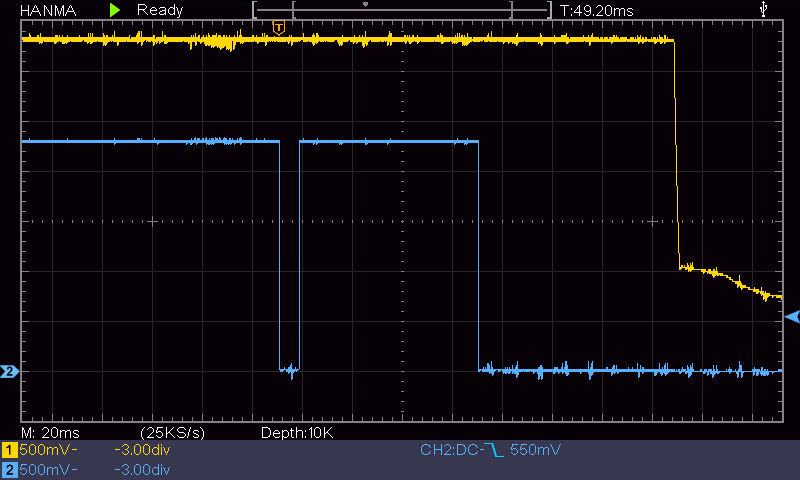

## Beschreibung

Die NanoBCU ist eine sehr kleine BCU (Bus Coupling Unit) für den KNX-TP1 Gebäudeautomatisierungsbus.  
Sie basiert auf den OnSemi NCN51xx KNX-Tranceiver-ICs. Die Größe der NanoBCU V2 beträgt lediglich 18x17x8 mm.

Mit der BCU können per UART Telegramme auf KNX-TP1 gesendet und empfangen werden. Weiterhin stellt sie die Spannungsversorgung der Geräts über den KNX-TP1 sicher.

Die Informationen hier gelten für die NanBCU V2, für die älteren V0 und V1 Versionen siehe [NanoBCU-V1](https://github.com/OpenKNX/OpenKNX/wiki/NanoBCU-V1)

## Eigenschaften

- IC: NCN5130 (auch NCN5121 und NCN5120)
- Größe: 18 x 17 x 8 mm
- Gewicht: ca. 4g
- Spannung 1: 3.3V
- Spannung 2: 3.3V, 5V, 12V, 21V. Lann durch Tausch der Widerstands R4 geändert werden beliebig geändert werden: 1.2V - 21V
- Ripple: ca. 50-100mV (Abhängig von Spannung und Strom)
- Max. Strom: 100mA @ 3.3V + 100mA @ 5V (2x 100mA nur mit NCN5130)
- Max. Busstrom: 40mA/20mA (5130/ 512x)
- UART: 19200bps 8E1 / Pegel **3.3V**, ab V02.10 wahlweise 38400bps wählbar

## Verfügbarkeit

Der Schaltplan der NanoBCU ist unter der freien [CC-BY-NC-SA](https://creativecommons.org/licenses/by-nc-sa/4.0/legalcode.de) verfügbar.

SMD-bestückte Bausätze können [hier](https://muster.ing-dom.de) gekauft werden.

Die KiCAD-Daten sind und werden nicht veröffentlicht.

## Aufbau

Eine gerade oder gewinkelte 1x7 Stift- oder Buchsenleiste RM 2.54mm einlöten.

## Dokumentation

- [Schematic V02.10](doc/NanoBCU_V02.10.sch.pdf)
- [3D-Modell V02.10](doc/NanoBCU_V02.10.step)

## Software-Integration

Es existieren diverse Bibliotheken mit denen eine NanoBCU genutzt werden kann.

Für ESP32 oder ARM-Mikrocontroller empfehlen wir den [OpenKNX stack](https://github.com/OpenKNX/knx).

Aber auch für kleinere 8Bit Controller als auch für .Net und Java existieren fertige Lösungen.

Das UART-Protokol der NCN51xx ist weitgehend kompatibel zum TPUart daher kann eine NanoBCU in gewissen Grenzen als Ersatz für eine TPUart-basierende Lösung verwendet werden.

## Hardware-Integration

Die [OpenKNX-KiCad-Lib](https://github.com/OpenKNX/OpenKNX-KiCad-Lib) enthält Footprints für diverse Montagemöglickeiten der NanoBCU.

## Benutzung des SAVE Ausgangs

Details zum Verhalten des SAVE-Pins und das Verhalten des NCN bei Busspannungsausfall stehen im jeweiligen NCN51xx-Datenblatt.

Der SAVE pin wird dazu verwendet um einen Busspannungsausfall einige Millisekunden vor dem Zusammenbrechen der 3.3V Versorgung zu erkennenen - der Kondensator der BCU puffert genug Energie um ggf. Daten zu persistieren.

Typischerweise beträgt die Zeit zwischen 50 und 200ms, abhängig vom Strombedarf des Gerätes.

Hier sieht man eine Messung mit einem Gerät mit 8.5ma Stromaufnahme aus dem Bus (ca 35mA @3.3V).
Wie man sehen kann, bleiben ca. 150ms bis die 3.3V Spannung einbricht.
Achtung, der SAVE pin kann prellen!

gelb: 3.3V Ausgang der BCU, blau: SAVE pin

## Versionsgeschichte

- V00.10 - erste Prototypenserie
- V00.11 - neuer C4 Kondensator Footprint für die optionale Benutzung eines flachen Tantalkondensators, PCB-Dicke auf 1.0mm reduziert
- V01.00 - OpenKNX-Logo
- V01.10 - Optimierung auf doppelseitige SMD-Maschinenbestückung (C4 nur Alu Cap)
- V02.00 - Verkleinerung auf 17x18, quadratische Lötpads, NCN5130 als Standard-NCN, PCB-Dicke auf 0.8mm reduziert
- V02.10 - Baudrate 19.2/38.4k einstellbar

## Varianten

Details zu den möglichen Bestückvarianten sind im Schaltplan zu finden.

## Links

- [Vorstellungs- / Entwicklunsthread im KNX User Forum](https://knx-user-forum.de/forum/projektforen/konnekting/1603350-nanobcu-ncn5120-weiterentwicklung-der-microbcu2)
- [Sammelbestellung KNX User Forum](https://knx-user-forum.de/forum/projektforen/openknx/1748827-sammelbestellung-nanobcu-und-zubeh%C3%B6r)

## Bilder

